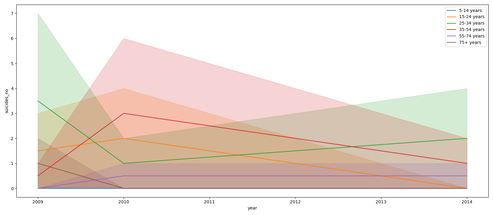

#  Pandas

General training in pandas library.


to create requirements.txt for any purpose run :
```bash
pip freeze > requirements.txt
```

to install ```requirements.txt``` run :
```bash
pip install -r requirements.txt
```





